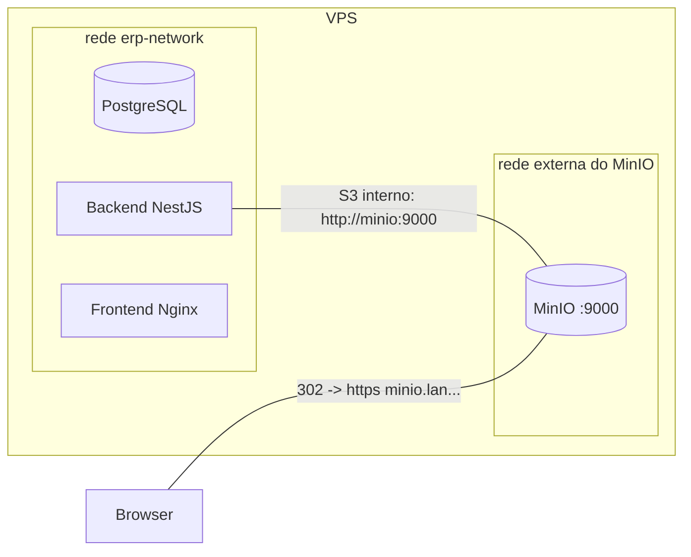
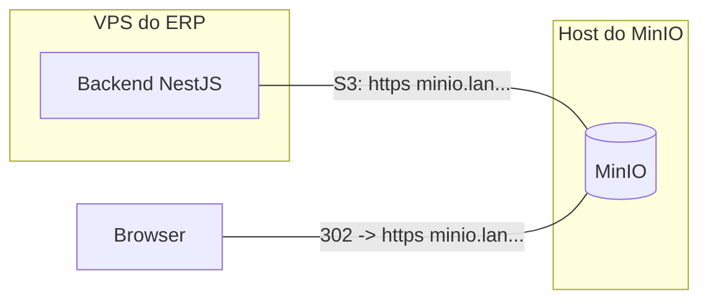

# MinIO como storage de uploads na VPS

Guia **operacional** de como o ERP Globaltec passará a usar o **MinIO** (S3-compatível)
para armazenar os arquivos de upload na VPS de produção, em vez de gravá-los no disco
do container backend (`/app/uploads` → volume `/var/erp-uploads`).

> Este documento é o complemento de produção do [`REFACTOR-MINIO.md`](./REFACTOR-MINIO.md).
> - `REFACTOR-MINIO.md` = **mudanças no código** (StorageModule, drivers `disk`/`s3`, controllers).
> - `MINIO-VPS.md` (este) = **infra da VPS**: rede, env, Nginx, buckets, migração, backup e rollback.

---

## 1. Objetivo e escopo

- Tirar os uploads do disco do container e centralizá-los no **MinIO** já existente
  (`minio.lan.alenxandriaglobaltec.com`).
- Manter **rollback imediato** via variável de ambiente `STORAGE_DRIVER=disk|s3`
  (sem rebuild, só restart do backend).
- **Não** alterar o schema do banco: os models Prisma continuam guardando **paths
  relativos** (ex.: `/uploads/tasks/123-abc.pdf`); quem resolve o destino físico é o
  backend, conforme o driver ativo.

**Fora de escopo aqui:** detalhes de implementação do código (ver `REFACTOR-MINIO.md`),
CDN, antivírus, quotas e versionamento de buckets.

---

## 2. Arquitetura alvo na VPS

```
                         HTTPS (erp.alenxandriaglobaltec.com)
  +-----------+   443    +------------------+
  |  Browser  | -------> |  Nginx (host)    |
  |  / App    |          |  TLS + proxy     |
  +-----------+          +---+----------+---+
        ^                    |          |
        | 302 redirect       | /api/    | /uploads/  /uploads-protegido/
        | (apenas leitura    | /        v
        |  PÚBLICA)          |     +-----------------------+
        |                    +---> |  Backend NestJS :3001 |
        |                          |  StorageService (s3)  |
        |                          +-----+-----------+-----+
        |                                |           |
        |        leitura PÚBLICA: 302    |           | leitura PRIVADA: stream
        |        -> URL do MinIO         |           | (mantém RBAC do JWT)
        |                                v           v
        |                          +--------------------------+
        +------------------------- |          MinIO           |
            GET direto no MinIO     |  erp-public / erp-private|
                                    +--------------------------+
```

Regras de ouro do desenho:

- **Escrita** (todos os uploads): o backend grava direto no bucket via `multer-s3`.
- **Leitura pública** (`/uploads/...`): o backend responde **302** redirecionando o
  browser para a URL do MinIO (`erp-public`, leitura anônima). O arquivo **não** trafega
  pelo backend.
- **Leitura privada** (`/uploads-protegido/...`): o backend **continua fazendo stream**
  do arquivo do bucket `erp-private`, preservando 100% do controle de acesso (JWT +
  permissões) que já existe hoje em
  [`uploads-protegidos.controller.ts`](../backend/src/modules/uploads/uploads-protegidos.controller.ts).

---

## 3. Topologia de rede (2 cenários)

A escolha define **como o backend alcança o MinIO** (endpoint S3) e se há rede Docker
compartilhada. O endpoint usado pelo **backend** (server-side) pode ser diferente da URL
usada pelo **browser** (redirect 302).

### Cenário A — MinIO na MESMA VPS, em Docker  ✅ RECOMENDADO

O MinIO roda como container na mesma VPS. O `backend` é conectado a uma **rede Docker
externa** compartilhada com o MinIO e fala com ele pelo nome do serviço, **sem sair para
a internet nem passar por TLS/Traefik**.



- **Backend (server-side):** `S3_ENDPOINT=http://minio:9000` (nome do container/serviço).
- **Browser (redirect 302):** `S3_PUBLIC_BASE_URL=https://minio.lan.alenxandriaglobaltec.com`.
- Vantagem: upload/download server-side trafega na rede interna (rápido, sem custo de TLS,
  sem depender de DNS público).

### Cenário B — MinIO em host/servidor separado

O MinIO está em outra máquina (ou só é acessível pelo hostname público/Traefik). Não há
rede Docker compartilhada.



- **Backend (server-side):** `S3_ENDPOINT=https://minio.lan.alenxandriaglobaltec.com`.
- **Browser (redirect 302):** `S3_PUBLIC_BASE_URL=https://minio.lan.alenxandriaglobaltec.com`.
- Observações: cada upload/download server-side passa por TLS/proxy externo (mais latência);
  o certificado do host do MinIO **precisa ser válido** (senão o SDK falha o handshake, ou
  exige flag de inseguro — não recomendado).

### Comparativo

| Critério | Cenário A (mesma VPS) | Cenário B (host separado) |
|---|---|---|
| Endpoint do backend | `http://minio:9000` (interno) | `https://minio.lan...` (externo) |
| Latência server-side | Baixa (rede Docker) | Maior (TLS + proxy) |
| Rede Docker compartilhada | Sim (rede externa) | Não |
| TLS no caminho backend→MinIO | Não necessário | Obrigatório e válido |
| Tolerância a falha de DNS público | Alta | Baixa |
| Complexidade de setup | Conectar rede no compose | Apenas env |
| **Recomendado quando** | MinIO está na própria VPS | MinIO é compartilhado/externo |

> **Recomendação:** usar o **Cenário A**. Mesmo com o MinIO na própria VPS, mantenha o
> `S3_PUBLIC_BASE_URL` como a **URL externa HTTPS**, pois ela é a que vai para o **browser**
> no redirect 302 (o navegador não enxerga `http://minio:9000`).

---

## 4. Buckets e políticas

| Bucket | Conteúdo (subdirs) | Política |
|---|---|---|
| `erp-public` | `general/`, `users/`, `projects/`, `tasks/`, `stock/` | Leitura anônima (anonymous read-only) |
| `erp-private` | `docs-rh/`, `ponto/`, `afastamentos/` | Privado (somente a Access Key do backend) |

Mapeamento subdir → bucket (mesmos subdirs usados hoje em disco):

| Origem (call-site) | Subdir | Bucket |
|---|---|---|
| `uploads.controller.ts` | `general/` | `erp-public` |
| `users.controller.ts` | `users/...` | `erp-public` |
| `projects.controller.ts` | `projects/` | `erp-public` |
| `tasks.controller.ts` | `tasks/` | `erp-public` |
| `stock.service.ts` | `stock/` | `erp-public` |
| `rh/documentos` | `docs-rh/` | `erp-private` |
| `rh/ponto` | `ponto/` | `erp-private` |
| `rh/afastamentos` | `afastamentos/` | `erp-private` |

---

## 5. Variáveis de ambiente na VPS

Adicionar ao `.env` da raiz do projeto na VPS (ex.: `/opt/ERP-Globaltec/.env`). As chaves
S3 só têm efeito quando `STORAGE_DRIVER=s3`.

**Cenário A (recomendado):**

```env
# Driver de storage: disk (atual) ou s3 (MinIO)
STORAGE_DRIVER=s3

# Endpoint usado pelo BACKEND (server-side) — rede Docker interna
S3_ENDPOINT=http://minio:9000
S3_REGION=us-east-1            # MinIO ignora, mas o SDK exige
S3_FORCE_PATH_STYLE=true       # MinIO requer path-style

# Credenciais dedicadas do backend (NÃO usar root) — ver seção 6
S3_ACCESS_KEY=__defina_no_minio__
S3_SECRET_KEY=__defina_no_minio__

# Buckets
S3_BUCKET_PUBLIC=erp-public
S3_BUCKET_PRIVATE=erp-private

# URL EXTERNA do MinIO — usada no redirect 302 para o BROWSER (leitura pública)
S3_PUBLIC_BASE_URL=https://minio.lan.alenxandriaglobaltec.com
```

**Cenário B (host separado):** igual ao A, trocando apenas o endpoint do backend:

```env
S3_ENDPOINT=https://minio.lan.alenxandriaglobaltec.com
```

> Mantenha `UPLOADS_DIR=/app/uploads` e o volume montado durante a transição — eles servem
> de fallback caso volte para `STORAGE_DRIVER=disk` (rollback). As chaves base já estão
> catalogadas no [`env.example`](../env.example) e no `REFACTOR-MINIO.md` (seção 5).

---

## 6. Setup no MinIO (uma vez, antes de virar o driver)

1. Acessar o console (`https://minio-console.lan.alenxandriaglobaltec.com`) com o usuário root.
2. Criar bucket **`erp-public`** → em *Buckets → erp-public → Anonymous → Add Access Rule*:
   prefixo `/`, acesso `readonly` (leitura anônima).
3. Criar bucket **`erp-private`** → manter o padrão (privado).
4. Criar uma **Access Key dedicada** para o backend (não usar a root):
   *Identity → Access Keys → Create*. Anote `Access Key` e `Secret Key`.
5. Anexar à Access Key uma policy mínima com `s3:GetObject`, `s3:PutObject`,
   `s3:DeleteObject` e `s3:ListBucket` restrita aos dois buckets:

```json
{
  "Version": "2012-10-17",
  "Statement": [
    {
      "Effect": "Allow",
      "Action": ["s3:GetObject", "s3:PutObject", "s3:DeleteObject", "s3:ListBucket"],
      "Resource": [
        "arn:aws:s3:::erp-public",
        "arn:aws:s3:::erp-public/*",
        "arn:aws:s3:::erp-private",
        "arn:aws:s3:::erp-private/*"
      ]
    }
  ]
}
```

6. Copie `Access Key`/`Secret Key` para `S3_ACCESS_KEY`/`S3_SECRET_KEY` no `.env` da VPS.

---

## 7. Ajustes no `docker-compose.yml` (documentar; aplicar no PR do refactor)

> Estas mudanças acompanham o refactor de código. Aqui ficam registradas para a infra da VPS.

**Cenário A — conectar o backend à rede do MinIO.** Descubra o nome da rede do MinIO
(`docker network ls`) e declare-a como **externa** no compose do ERP:

```yaml
services:
  backend:
    # ... config atual ...
    environment:
      # ... envs atuais ...
      STORAGE_DRIVER: ${STORAGE_DRIVER:-disk}
      S3_ENDPOINT: ${S3_ENDPOINT:-}
      S3_REGION: ${S3_REGION:-us-east-1}
      S3_FORCE_PATH_STYLE: ${S3_FORCE_PATH_STYLE:-true}
      S3_ACCESS_KEY: ${S3_ACCESS_KEY:-}
      S3_SECRET_KEY: ${S3_SECRET_KEY:-}
      S3_BUCKET_PUBLIC: ${S3_BUCKET_PUBLIC:-erp-public}
      S3_BUCKET_PRIVATE: ${S3_BUCKET_PRIVATE:-erp-private}
      S3_PUBLIC_BASE_URL: ${S3_PUBLIC_BASE_URL:-}
    volumes:
      - ./backend/prisma:/app/prisma:ro
      # Manter durante a transição (fallback/rollback para STORAGE_DRIVER=disk):
      - /var/erp-uploads:/app/uploads
    networks:
      - erp-network
      - minio-net          # rede compartilhada com o MinIO (Cenário A)

networks:
  erp-network:
    driver: bridge
  minio-net:
    external: true
    name: <NOME_REAL_DA_REDE_DO_MINIO>   # ex.: proxy
```

**Cenário B:** não precisa da rede extra; basta declarar as mesmas `environment` S3 e usar
`S3_ENDPOINT=https://minio.lan...`. O serviço `backend` continua só na `erp-network`.

---

## 8. Ajustes no Nginx (`deploy/nginx-erp.conf`)

- **`location ^~ /uploads-protegido/`** — permanece **idêntico**. O backend faz stream do
  bucket `erp-private` com o JWT; o Nginx só repassa (`proxy_pass` para `:3001`, com
  `Authorization`).
- **`location ^~ /uploads/`** — permanece apontando para o backend (`:3001`). A diferença é
  que, com `STORAGE_DRIVER=s3`, o backend responde **302** para a URL do MinIO em vez de
  servir o arquivo. O Nginx repassa o 302 sem mudanças de configuração.
- **CSP** — o header `Content-Security-Policy` atual lista origens explícitas. Como o browser
  passará a buscar imagens/arquivos no domínio do MinIO, inclua o host do MinIO nas diretivas
  relevantes:
  - `img-src` → adicionar `https://minio.lan.alenxandriaglobaltec.com`
  - `connect-src` → adicionar `https://minio.lan.alenxandriaglobaltec.com`
  - `frame-src` / `object-src` → adicionar o host se viewers (PDF, etc.) carregarem direto do MinIO

  Exemplo de ajuste (adicionando o host do MinIO ao bloco existente):

```nginx
add_header Content-Security-Policy "default-src 'self'; script-src 'self' 'unsafe-eval'; style-src 'self' 'unsafe-inline'; img-src 'self' data: blob: https://*.tile.openstreetmap.org https://minio.lan.alenxandriaglobaltec.com; font-src 'self' data:; connect-src 'self' blob: https://nominatim.openstreetmap.org https://minio.lan.alenxandriaglobaltec.com; frame-src 'self' blob: data: https://minio.lan.alenxandriaglobaltec.com; worker-src 'self' blob:; frame-ancestors 'none'; object-src 'self' blob: data: https://minio.lan.alenxandriaglobaltec.com;" always;
```

Depois: `sudo nginx -t && sudo systemctl reload nginx`.

> O domínio do MinIO precisa de **TLS válido** para o browser (o 302 leva o navegador até lá).
> Se o MinIO estiver atrás de Traefik com Let's Encrypt, isso já está atendido.

---

## 9. Migração dos arquivos existentes (uma vez, antes do flip)

Os arquivos atuais estão em `/var/erp-uploads/<subdir>` na VPS. Copie-os para os buckets
com o cliente `mc` do MinIO **antes** de virar `STORAGE_DRIVER=s3`. A operação é idempotente
(reexecutar não duplica).

```bash
# Na VPS, configurar o alias do mc apontando para o MinIO interno
docker run --rm --network <NOME_REAL_DA_REDE_DO_MINIO> \
  -v /var/erp-uploads:/data:ro \
  --entrypoint /bin/sh minio/mc -c '
    mc alias set erp http://minio:9000 <ACCESS_KEY> <SECRET_KEY> &&

    # Públicos -> erp-public
    mc mirror --overwrite /data/general      erp/erp-public/general &&
    mc mirror --overwrite /data/users        erp/erp-public/users &&
    mc mirror --overwrite /data/projects     erp/erp-public/projects &&
    mc mirror --overwrite /data/tasks        erp/erp-public/tasks &&
    mc mirror --overwrite /data/stock        erp/erp-public/stock &&

    # Privados -> erp-private
    mc mirror --overwrite /data/docs-rh      erp/erp-private/docs-rh &&
    mc mirror --overwrite /data/ponto        erp/erp-private/ponto &&
    mc mirror --overwrite /data/afastamentos erp/erp-private/afastamentos
  '
```

> Use `<ACCESS_KEY>`/`<SECRET_KEY>` da Access Key dedicada (seção 6). No Cenário B, troque
> `http://minio:9000` por `https://minio.lan.alenxandriaglobaltec.com` e remova o `--network`.
> Subdirs inexistentes simplesmente não copiam nada — sem erro fatal.

---

## 10. Flip do driver e rollback

**Ativar o MinIO:**

```bash
cd /opt/ERP-Globaltec
# editar .env -> STORAGE_DRIVER=s3 (+ chaves S3 da seção 5)
docker compose up -d backend
docker compose logs -f backend   # conferir que subiu sem erro de conexão S3
```

**Rollback (se algo quebrar):**

```bash
cd /opt/ERP-Globaltec
# editar .env -> STORAGE_DRIVER=disk
docker compose up -d backend
```

- Como o volume `/var/erp-uploads` permanece montado, o backend volta a ler/gravar em disco
  imediatamente. **Não há perda de dados.**
- Arquivos enviados ao MinIO durante a tentativa ficam nos buckets (acessíveis de novo se
  voltar para `s3`). Nenhuma mudança no schema Prisma é necessária para o rollback.

---

## 11. Impacto no backup

Hoje o [`deploy/backup-erp.sh`](../deploy/backup-erp.sh) compacta `/var/erp-uploads`
(ver [`BACKUP-VPS.md`](../deploy/BACKUP-VPS.md)). Com `STORAGE_DRIVER=s3`, os **uploads novos
deixam de cair nesse diretório** — então o backup atual passaria a cobrir só o banco e os
arquivos antigos.

Ações para manter cobertura total:

- **Backup dos buckets** com `mc mirror` para um diretório que entre no backup, ou para um
  destino off-site:

```bash
# Espelhar os buckets para um diretório local incluído no backup
docker run --rm --network <NOME_REAL_DA_REDE_DO_MINIO> \
  -v /var/erp-minio-backup:/out \
  --entrypoint /bin/sh minio/mc -c '
    mc alias set erp http://minio:9000 <ACCESS_KEY> <SECRET_KEY> &&
    mc mirror --overwrite --remove erp/erp-public  /out/erp-public &&
    mc mirror --overwrite --remove erp/erp-private /out/erp-private
  '
```

- **Alternativa:** snapshot/volume do próprio MinIO (se ele tiver volume Docker dedicado) e
  incluir esse volume na rotina de backup.
- Atualizar o `backup-erp.sh`/`BACKUP-VPS.md` para apontar `ERP_UPLOADS_DIR` para o diretório
  espelhado (`/var/erp-minio-backup`) **ou** acrescentar um passo de `mc mirror` antes do
  `tar`.

> Enquanto o volume `/var/erp-uploads` continuar montado (transição), o backup atual ainda
> protege os arquivos antigos; o novo passo cobre os arquivos que nascem direto no MinIO.

---

## 12. Checklist de validação na VPS

Após o flip (`STORAGE_DRIVER=s3`), validar manualmente:

- [ ] Upload genérico (`POST /api/uploads`) → objeto aparece em `erp-public/general/`
- [ ] Avatar de usuário → `erp-public/users/`
- [ ] Anexo de tarefa → `erp-public/tasks/`
- [ ] Anexo de projeto → `erp-public/projects/`
- [ ] Foto de estoque → `erp-public/stock/`
- [ ] Documento RH → `erp-private/docs-rh/`
- [ ] Foto do ponto → `erp-private/ponto/`
- [ ] Anexo de afastamento → `erp-private/afastamentos/`
- [ ] `GET https://erp.../uploads/general/<file>` retorna **302** para o MinIO e o GET seguinte funciona
- [ ] `GET https://erp.../uploads-protegido/docs-rh/<file>` **com JWT válido** retorna o arquivo (stream)
- [ ] Mesmo path protegido **sem JWT** retorna 401/403 (RBAC preservado)
- [ ] Imagens/arquivos abrem no frontend sem erro de **CSP** (host do MinIO liberado no Nginx)
- [ ] Restart do backend (`docker compose up -d backend`): arquivos seguem acessíveis (persistência no MinIO)
- [ ] Teste de **rollback**: `STORAGE_DRIVER=disk` volta a servir os arquivos antigos do volume
- [ ] Rotina de **backup** dos buckets executada e validada (seção 11)

---

## 13. Resumo de decisões

- **Cenário A** (MinIO na própria VPS, rede Docker interna) é o recomendado: melhor
  desempenho e sem depender da internet/TLS para o tráfego server-side.
- `S3_ENDPOINT` (backend) ≠ `S3_PUBLIC_BASE_URL` (browser): o primeiro é interno, o segundo
  é a URL HTTPS pública usada no redirect 302.
- **Leitura pública** → 302 para o MinIO; **leitura privada** → stream pelo backend (RBAC intacto).
- `STORAGE_DRIVER` permite rollback sem rebuild; o volume `/var/erp-uploads` fica como rede de segurança durante a transição.
- Sem mudanças no schema Prisma. Ajustar a rotina de backup para cobrir os buckets.
